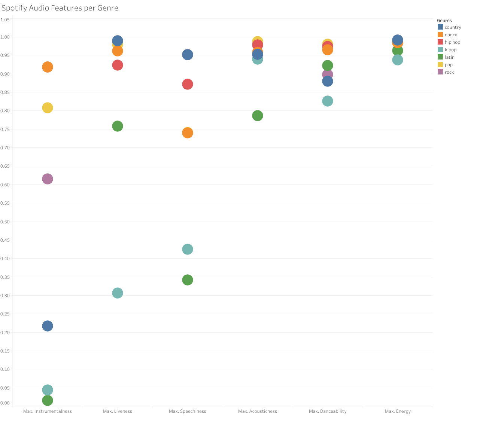

# K-Pop: How Popular Is It?
## Comparing 10 Years of Music Data from *Billboard* Hot 100  and Spotify
Made in collaboration between [Jessica Veilleux](https://github.com/jveilleux2314), [Kailey Davis](https://github.com/kaileymd), [Kenneth Beadle](https://github.com/K-Beadle), and [Miranda Wylie](https://github.com/mirandawylie). View our [dashboard](https://k-pop-pop.herokuapp.com/). View our [presentation](https://docs.google.com/presentation/d/18R-miYkgG67zDTOXOeS0VitBn73jQj7eH99ADQq1drc/edit?usp=sharing).

K-pop, or popular music from Korea, is increasing in popularity in the United States, so much so that the Billboard 100 includes it in it’s top 7 genre categories along with Rock and Hip-Hop.

The rise of K-pop and its dedicated fan base has caused cultural waves that touched [the 2020 election, sparked political activism](https://www.cnn.com/2020/06/22/asia/k-pop-fandom-activism-intl-hnk/index.html) and created wildly popular merchandising deals, like [one K-Pop band's McDonald's Meal](https://www.businessinsider.com/mcdonalds-bts-meal-drives-traffic-to-restaurants-over-travis-scott-meal-2021-6). With as much influence as K-Pop has outside of the music world, we wanted to know: how popular is K-Pop music, actually? How does the popularity of K-pop compare with the popularity of other top Billboard 100 music categories: Country, Dance, Hip-Hop, Latin, Pop and Rock?

### Music Popularity
There are many elements to what makes music popular. We decided to rely on song ranking from *Billboard* charts and Spotify’s own popularity score as parameters for popularity. In addition, Spotify gives each song an audio features ranking and we used this ranking to determine similarities in what makes a song popular.

It is worth noting that *Billboard* and Spotify do not classify songs in a genre, so we had to rely on Spotify’s artist genre classification and apply that to all of their songs. For example, if an artist like Lil Nas X is categorized in Pop, Country, and Hip-Hop, then all his songs will appear in each of those genres. While this does duplicate information across genres, the ratios between genres are still relevant. Ultimately, our goal is not to debate genre-blurring songs like *Old Town Road* and place one genre over another.

### What Do We Hope to Find?
Using the data from Spotify on the last 10 years of popular music, we hope to see if K-Pop's rankings in the charts reflects its popularity in news headlines. Specifically, we will look at the popularity of the top 7 music genres from *Billboard* by way of how long a song is on the *Billboard* chart. Using Spotify's audio feature data we will examine if certain features like danceability plays a role in song popularity and staying power on the charts.

Additionally, we will train a machine learning model using Spotify's audio features to predict if a song will stay on the Billboard Hot 100 charts for longer than the average (12 weeks).

## Music Analysis

### Popularity

K-pop is a relatively new music genre in the United States. It hit the Hot 100 in 2012 with Psy's *Gangnam Style* and has consistently stayed on the charts since. While its popularity on this graph appears to be low compared to the other genres, keep in mind the numbers are largely influenced by the number of songs in a genre and not as many artists are contributing to the K-pop genre as the Hip-Hop category in the U.S. market.

The K-pop songs that hit the Hot 100 are much more popular than songs of other genres. The average length of time for any song to stay on the Hot 100 is 12 weeks. A K-pop song averages 17.8 weeks. For comparison, K-pop’s nearest genre competitor, Dance, has an  average of 13 weeks on the Hot 100 Billboard chart.

Due to the low number of K-pop songs on the charts over the last 10 years (8,000 compared to nearly 216,000 dance songs) it is hard to say if this staying power is because only the best of the best make it to U.S. audiences, or if there are other qualities that make K-pop stand out.

### Spotify Audio Features
Spotify assigns all content on their platform a value between 0 and 1 in each of the following 9 audio features:
- Acousticness: unaltered by electricity, synthesizers and other sound modifying tools
- Energy: measure of intensity and activity, feel fast, loud, and noisy
- Instrumentalness: vocal content or not
- Liveness: recorded with a live audience or not
- Loudness: average deibel (-60 and 0 db.) range
- Speechiness: speaking instead of singing, more for audio book, podcast
- Tempo: average the beats per minute (BPM)
- Valence: musical positiveness conveyed by a track (high = happy, euphoric, low = sad, angry)

For the sake of this project we focused on the acousticness, energy, instrumentalness, liveness, loudness and speechiness. What immediately stands out when comparing the features across these genres are the similarities in values. This would indicate that songs popular enough to hit the Hot 100 have much in common in areas like energy and acousticness.

K-pop mostly differs on instrumentalness, liveness and speechiness. Instrumentalness and speechiness are similar measurements, where speechiness indicates a ratio of spoken words vs. music in a track and instrumentalness predicts if a song contains vocals, indicating the presence of vocals and how much they *sound* like spoken words, discounting lyrical noises like "ooh" and "ahh." Liveness detects the presence of an audience.

Scoring low in both instrumentalness and speechiness could indicate either a key difference in song composition, or a flaw in Spotify's algorithm when analyzing foreign languages. Scoring so different in liveness is a commentary on how K-pop bands represent themselves online. In Korea, K-pop bands are known as "idol groups" and are seen as role models. Part of the idolization is releasing polished, studio versions of songs that fit the perfect, polished image of these idols.

## Can AI Predict Everyone's New Favorite Song?

### Machine Learning
While Spotify's audio features are difficult to interpret when grouped by genre, can they still tell us something about a song's popularity? The average length of time a song stays on the Hot 100 is 12 weeks. We asked our machine learning model to predict if a song would meet or beat the 12 week average, or would the song underperform?

Due to what we assumed would be complex relationships between our individual data points and over 50,000 rows of data, we tested our data using two different machine learning methods: a neural network model and a random forest model. From our complete data set, we used the pre-existing numeric fields of Spotify audio features, Spotify's popularity metric and the Hot 100 song ranking. No further numeric manipulation was necessary to scale the features since they were already similar.

After some experimentation with the training/testing data split, neural network layers and quantity of decision trees to optimize accuracy, we found that the Random Forest model was our best performing model. It trained on 90% of the data and was tested on the remaining 10% due to our large amount of data and resulted in a 73.3% accuracy. The neural network was also successful but only scored at 70% accuracy.

The downside to both the neural network and Random Forest models is that they can require a lot of computer resources to train the model and *how* they make the decisions they do to make their predictions can be hard to interpret. To help us understand what influenced the Random Forest model, we had the model list the features it used in order of importance. We learned that Spotify's audio features were not very useful in making a prediction. However, a song's ranking on the Hot 100 had the most importance and influence on our model by a significant margin.

Both the neural network model and a random forest model can predict if a popular song will stay on the charts for longer than average.

## Conclusion
Since 2012, K-Pop has shown that it has the ability to stay relevant to U.S. audiences. As massively popular groups like BTS (the band behind *Butter* and *Permission to Dance*, both #1 hits summer 2021) continue to spread awareness of the genre, interest in K-Pop will continue to grow in the U.S.

Spotify's audio features, while interesting, are mostly inconclusive. Our machine learning model shows that the most important feature for helping to determine how long a song will stay on the Hot 100 *is* its ranking - in other words, the more popular you already are, the more likely you are to stay. Spotify shows that popular songs often have similar features, but at this level of popularity, those features aren't very useful to differentiate songs from each other.

So does K-Pop's reputation in the headlines as a hot new trend reflect its popularity in the music world? While nothing conclusive stands out from its audio features, K-Pop hits are beloved - meaning that their popularity likely lies *within* their reputation, and with other indicators outside of the purely musical realm.

## Technologies, Laguages, Tools
Backend: Python, AWS
Frontend: HTML, CSS, Bootstrap, Heroku
Databases: PostgreSQL, pgAdmin, MongoDB
Libraries: Pandas, Scikit Learn
Tools: Tableau, Jupyter Notebook, Flask

## Data Sources
- [Billboard Hot 100 from Kaggle](https://www.kaggle.com/dhruvildave/billboard-the-hot-100-songs) which documents the position of every song on the Hot 100 from week to week since the 1950's.
- [Spotify API](https://developer.spotify.com/documentation/web-api/reference/#endpoint-get-recommendations) to discover a song's acousticness, danceability, energy, and other audio features.
- [Spotify csv from Kaggle](https://www.kaggle.com/yamaerenay/spotify-dataset-19212020-160k-tracks?select=tracks.csv) to assist with genre classification.
